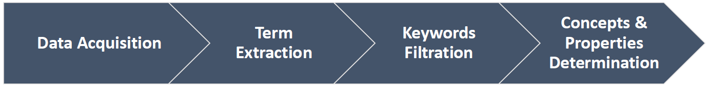

# BiodivOnto

Biodiversity is the variety of life on earth which covers the evolutionary, ecological, and cultural processes that sustain life. Therefore, it is important to understand where biodiversity is, how it is changing over space and time, the driving factors of these changes and the resulting consequences on the diversity of life.  To do so, it is necessary to describe and integrate the conditions and measures of biodiversity to fully capture the domain. In this paper, we present the design of a core ontology for biodiversity aiming to establish a link between the foundational and domain-specific ontologies.  The proposed ontology is designed using the fusion/merge strategy by reusing existing ontologies and it is guided by data from several resources in the biodiversity domain. 
## How it Works?

1.  Data Acquisition
    * Collecting data from 3 data sources (BEFChina, data.world and Semedico)
2.  Term Extraction 
    * Manual step, we used GATE tool to mark the Biodiversity related terms 
    * Process GATE documents and extract list of the annotated keywords.    
3.  Keywords Filtration
    * Words normalization is applied, all words are unique, case insensitive and in a singular form.
    * Multiple manual revisions are done on the extracted keywords list with biodiversity experts involvement 
4. Concepts and Relation Determination
    * We calculate the overlap keywords among our work and the external data sources, see below.
    * The intersected keywords are used as initial seeds
    * Seed based clustering is then applied given the initial seeds and the rest of keywords
        * We used word2vec for words representation and cosine as similarity measure 
    * Multiple manual revisions on the created clusters are applied with seeds change.
        * Each revision iteration we modify the seeds by selecting more generic keywords.
    * We applied WordNet similarity among the final seeds to determine the core concepts
    * Relations among these core concepts are determined by domain experts.

## Project Structure
* `data`
    * `collected` data (original, processed and annotated) with their licenses 
    * `external` data 
        * Our processed version of [QEMP](https://github.com/fusion-jena/BiodivTagger/tree/master/QEMP) corpus.
        * [AquaDiva](https://fusion.cs.uni-jena.de/fusion/projects/aquadiva-infra-1-semantic-technologies-for-scientific-data-management-and-text-mining/)
        * [Soil Keywords](https://dl.gi.de/handle/20.500.12116/21802)
* `scripts` implementation for the (semi)automated parts of our pipeline above.
    * `crawl` the used script to fetch data from Semedico
    * `preprocess` data transformation i.e., from original format to our processed versions
    * `keywords_extractor` extracts annotated keywords from given files into list
    * `clustering` seed-based clustering for keywords grouping
* `outcome` contains our step by step results:
    * extracted keywords
    * seeds 

## Data sources
* [**BEFChina**](https://china.befdata.biow.uni-leipzig.de/) a joint Chinese German-Swiss biodiversity research. project
* [**data.world**]({https://data.world/) the world’s largest collaborative data community.
* **Semedico**
    * `@inproceedings{semedico,
        title = "{S}emedico: A Comprehensive Semantic Search Engine for the Life Sciences",
        author = "Faessler, Erik  and
          Hahn, Udo",
        booktitle = "Proceedings of {ACL} 2017, System Demonstrations",
        month = jul,
        year = "2017",
        address = "Vancouver, Canada",
        publisher = "Association for Computational Linguistics",
        url = "https://www.aclweb.org/anthology/P17-4016",
        pages = "91--96",
    }`

## Credits

Credits goes to our third party collaborators for the external data sources.

* QEMP Corpus 
    * `@inproceedings{loffler2020tag,
      title={Tag Me If You Can! Semantic Annotation of Biodiversity Metadata with the QEMP Corpus and the BiodivTagger},
      author={L{\"o}ffler, Felicitas and Abdelmageed, Nora and Babalou, Samira and Kaur, Pawandeep and K{\"o}nig-Ries, Birgitta},
      booktitle={Proceedings of The 12th Language Resources and Evaluation Conference},
      pages={4557--4564},
      year={2020}
    }`

* Soil keywords from Udovenko et.al master thesis
    * `@article{thesis1,
      title={Entity Extraction in the Ecological Domain--A practical guide},
      author={Udovenko, Vladimir and Algergawy, Alsayed},
      journal={BTW 2019--Workshopband},
      year={2019},
      publisher={Gesellschaft f{\"u}r Informatik, Bonn}
    }`
 
 * AquaDiva project
    * https://fusion.cs.uni-jena.de/fusion/projects/aquadiva-infra-1-semantic-technologies-for-scientific-data-management-and-text-mining/

## Acknowledgments
* This work has been funded by the project "A Virtual Werkstatt for Digitization in the Sciences (P5)" within the scope of the program line "Breakthroughs: Exploring Intelligent Systems" for "Digitization"
* Further support from the Deutsche Forschungsgemeinschaft (DFG) as part of the CRC 1076 [AquaDiva](http://www.aquadiva.uni-jena.de/)

## Citation
Please cite the following paper if you used any part of this work.

`@article{biodivonto,
      title={BiodivOnto: Towards a Core Ontology for Biodiversity},
      author={Abdelmageed, Nora and Samuel, Sheeba and Algergawy, Alsayed and K{\"o}nig-Ries, Birgitta},
      booktitle={Poster & Demo Track, ESWC },
      year={2021}      
    }`

## BiodivOnto Media
* Poster: https://fusion-jena.github.io/BiodivOnto/ 
* 1 min YouTube video: https://www.youtube.com/watch?v=ZSM5-TfMqXk&list=PLAZxp5wQmTBUF7x2YMo9nQlOAPKVhK8la&index=3
